# Superscalar Out of Order RISC-V Execution with the Reorder Buffer

# Introduction

To increase the instructions per cycle (IPC) of a processor, the
superscalar system was designed. Superscalar systems implement a level
of parallelism on a processor. Combining this with out-of-order
execution results in a robust system that has the potential to execute
instructions at a much faster speed. To maintain precise exceptions,
this system can be amended with the Reorder Buffer. With precise
exceptions, many of the problems of executing a program out-of-order are
solved.

For this project, the goal is to implement the superscalar out-of-order
RISC-V processor with a reorder buffer. The processor should be able to
execute three types of instructions, support three functional units, and
follow the RISC-V ISA. It should also stall and end the execution
depending on data hazards and instruction completion respectively.
Lastly, it should be designed in a way that efficiently implements
Tomasulo's algorithm.

# High-Level System Design

To achieve these goals, 8 distinct modules have been designed and can be
defined as follows.

     **Module Name**      **Abbreviation**                       **Description**
  ---------------------- ------------------ ----------------------------------------------------------
    Instruction Queue            IQ                        Provide instructions to DUs
      Dispatch Unit              DU          Decode instructions, check for hazards, send data to RAT
      Register File              RF                      Hold data, send data to each RS
   Register Alias Table         RAT                   Hold data & tags, send data to each RS
   Reservation Station           RS            Solve data hazards, hold instructions for ADDER/MUL
     Functional Unit         ADDER/MUL                         Execute instruction
      Branch Checker             BC                Check for branch exceptions and send to ROB
      Reorder Buffer            ROB                  Store instruction data before committing

These five components combine to create the superscalar out-of-order
RISC-V processor design. This project has been simplified to only handle
ADD/MUL instructions, however, this project could be expanded to address
each type of instruction. The image below shows the basic high-level
design and how the data should flow.

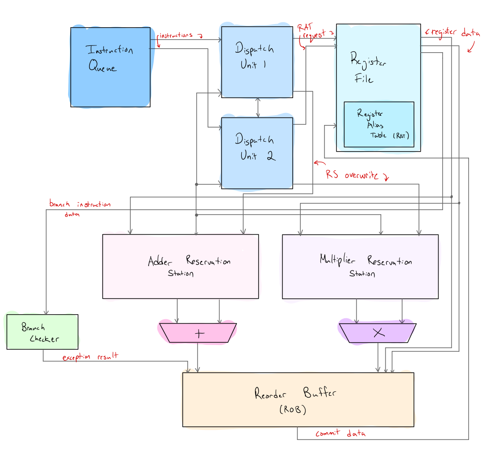

Starting at the instruction queue, two instructions will be sent at a
time to each dispatch unit. This allows for a 2-way superscalar
processor. After processing and checking for any structural or data
hazards, a register file request will be made. This request tells the RF
to send data to the respective reservation station. At the same time,
the data will be sent to the reorder buffer. In the case that there is a
branch instruction, data will also be sent to the branch checker. The
reservation station handles most of the data hazards and allows for
out-of-order execution. The ROB keeps the instructions in order,
allowing for precise exceptions and mispredictions.

Once there are valid instructions, the reservation stations will send
instructions to the adder and multiplier functional units. After a
certain number of cycles, each functional unit will output the data on
the result bus. This will be heard by the reorder buffer only. Once the
reorder buffer receives the data, it checks for an exception. If there
is no exception, then the data can be committed to the register file.
The data commit completes the full execution of 1 instruction. This
cycle continues until all instructions have been completed.

In the case that there is an exception, then the pipeline must be
flushed. The reorder buffer removes all instructions between the head
and tail pointers, and each module will stop its execution. The program
counter in the instruction queue will jump to the correct instruction
and resume from there. With the reorder buffer, this process is precise,
because without it, it is unknown where the execution can resume.

# SystemVerilog Modules

The modular structure and design choices will be broken down in this
section. Each module runs both synchronously and asynchronously to
enable the sub-clock cycle speeds that superscalar architecture can
achieve. This results in each module having the clock signal as an
input.

## Instruction Queue

The instruction queue is a single module that provides instructions to 2
separate dispatch units. This is the start of the pipeline and handles
the instruction fetch (IF) stage of the RISC-V pipelined CPU.

The two inputs to this module are the ready signals from each dispatch
unit. Once both dispatch units have processed and sent out their
signals, they will turn on their ready flags and request another
instruction from the instruction queue (IQ).

The only outputs of this module are the instructions themselves and a
flag that turns on when the instruction queue is empty. This helps
achieve one of the project goals, which is to turn off the simulation
once all instructions have been completed. This goal is completed in the
dispatch unit.

Lastly, each instruction is fetched in order. This means that each
respective dispatch unit will receive its own instruction from the
program order. If there are instructions left in the queue, the module
will output the first instruction, increment the counter, and then
output the next instruction.

## Dispatch Units

The dispatch unit is one of the more complex modules because of all the
checks it performs before allowing instructions to pass. It has been
designed in this project to perform a 3-stage checking process. There
are 2 dispatch units used, which will be referred to as DU1 and DU2. It
can be assumed that DU1 has priority, meaning its instructions will be
processed right before DU2's instructions are processed by the register
file (RF). This helps fulfill the superscalar aspect of the project
goals, allowing for two instructions to be decoded at once.

### Stage 1: Decode

To simplify the modules, the decode stage (ID) of the RISC-V pipelined
CPU is performed in this dispatch module. Essentially this checks what
type of instruction it is by using the RISC-V instruction breakdown. The
figure below is from the RISC-V green card \[1\].

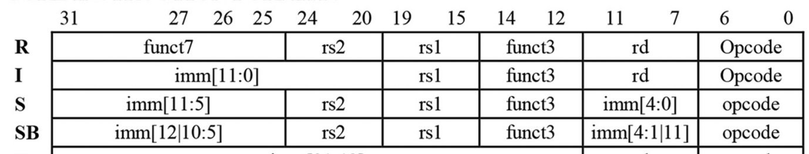

Since only both R-type and SB-type instructions are being performed in
this project, the relevant rows are the first and the last in the above
figure. The below images show the add, mul, and beq instructions from
the same source.

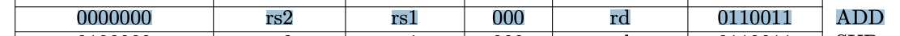

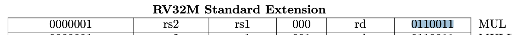

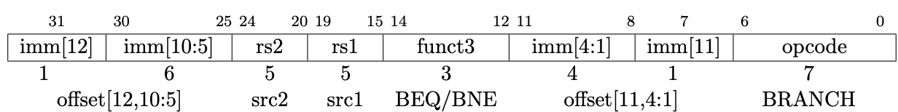

The first two instructions have the same funct3 and the same opcode.
Where they differ is the funct7, where MUL is 1 instead of 0. To
implement a no operation (nop), any code that does not follow either of
these two instructions is processed as a nop.

For the beq instruction, the instruction has been modified slightly. The
src1 and src2 are the same, along with the opcode of \"1100011\". The
immediate bits however are being treated as the address to jump to
directly. If bits 31:25 are being treated as imm1 and bits 11:7 are
imm2, the address is simply the concatenation: imm1, imm2. This address
is extended to 32 bits, making it a valid PC address. This allows the
program counter in the instruction queue to jump to the correct address.

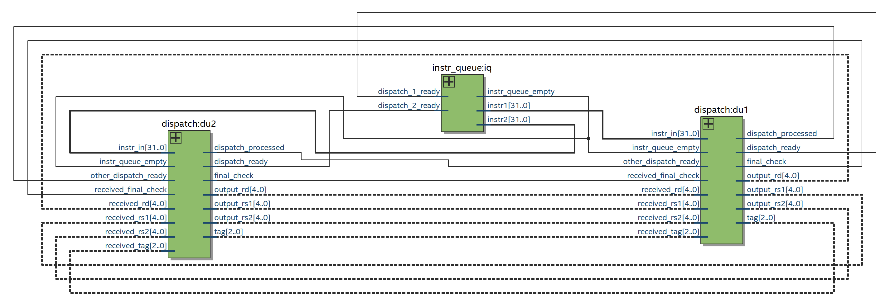

Once the instruction is decoded, each DU has determined what their
registers (rs1, rs2, and rd) for the instruction are. Each DU has also
determined the type of instruction. The DUs then communicate this data
with each other and move on to stage 2. The figure above shows the
signals that are communicated between each dispatch unit.

### Stage 2: Structural Hazard Detection

Another goal of this project is for both dispatch units to stall if
there is a structural hazard. This essentially means that each dispatch
unit should know if there is enough room in the reservation station for
each instruction.

To solve this problem, two signals are coming from each reservation
station to both DUs. The first signal is a 2-bit count on the number of
remaining spots. Since both DUs know what type of instructions are being
sent, they can use the number of remaining spots to check if there is
space for both instructions. The 4 cases are checked as shown in the
below code snippet.

{width="100%"}

The other signal is a 4-bit encoded signal that tells the DU which slots
are open. For instance, the signal will be \"0000\" when all slots are
open, \"1110\" when the first slot is open, and \"0010\" when only the
second slot is occupied.

With this data, the module can determine which slot to send the
instruction to in the reservation station based on its priority. The DU
with higher priority will get the first slot. This matters in this
example corner case: \"0011\" from the adder reservation station. With
slots 1 and 2 taken, the correct response should be: DU1 gets slot 3 and
DU2 gets slot 4.

### Step 3: RAW Hazard & Instruction Dispatch

During this stage, DU2 checks for a RAW hazard. A RAW hazard is checked
by seeing if the rd from DU1 is equal to either the rs1 or rs2 of RU2.
DU2 must check for this because it does not have priority, so it must
update the respective RS with the tag if it does exist. This is
accomplished through an override signal sent directly to the correct
RS.

After this occurs, then the instruction can finally be sent to the RF.
The encoded instruction contains the registers used by the instruction
and the intended destination in the form of a tag.

## Register File

The RF stores the register data in 32 entries each comprise of 32 bits.
Inside the register file is the addition of the Register Alias Table
(RAT). The RAT essentially keeps a mapping between the tags of the ROB
and the physical register. This allows the data to be sent to the
correct entry in the ROB where it is eventually committed back to the
RF. For the RAT, the simple breakdown can be seen in the table below.

          Valid   Reorder Buffer Tag
  ------ ------- --------------------
   Bits     3            2:0

The initialization of this module will set each register value in the RF
to its respective register number. This saves time and reduces the
project scope so I-type instructions are not implemented. A part of the
initialization step can be seen in the below figure.

{width="50%"}

After initialization, the RF will listen for two types of flags. The
first flag comes from instructions and the second comes from updates
from the reorder buffer. When an instruction is received from the DUs,
the RF will first update the RD with the tag. Next, the RF will send the
data to the correct reservation station to be executed.

When there is a commit from the reorder buffer, the value will be
updated in the respective entry by matching the tag. Additionally, the
RF will display any updates in the simulation console.

## Reservation Stations

In this project, there is a reservation station for each of the two
functional units. The reservation station solves the data hazards that
were not previously covered, including WAW, RAR, and another case of
RAW. The breakdown of each entry in the RS can be seen below.

<!-- ::: center -->
          rs1 Valid   rs1 Tag   rs1 Value   rs2 Valid   rs2 Tag   rs2 Value
  ------ ----------- --------- ----------- ----------- --------- -----------
   Bits      71        70:68      67:36        35        34:32      31:0
<!-- ::: -->

The full reservation station contains four entries which can be seen in
the following table. All values can be assumed as binary except for the
two decimal value fields.

<!-- ::: center -->
   ID    rs1 Valid   rs1 Tag   rs1 Value (decimal)   rs2 Valid   rs2 Tag   rs2 Value (decimal)
  ----- ----------- --------- --------------------- ----------- --------- ---------------------
   000       0         111              0                0         111              0
   001       0         111              0                0         111              0
   010       0         111              0                0         111              0
   011       0         111              0                0         111              0
<!-- ::: -->

Looking at the ID, there is an unused bit which is the most significant
bit (MSB). This bit is used to specify whether the reservation station
is for the adder or the multiplier functional unit. In this project, the
MSB being \"0\" represents the adder unit, and \"1\" represents the
multiplier unit.

In the initialization step of the RS, the adder reservation station, or
RS_ADD, will look like the table above. Both the valid bits and the
values are set to 0. The tag bits are set to \"111\", which is known as
the \"no tag code\". This is used to be able to tell if the tag has been
modified by the dispatch unit.

The reservation station has four main functions. The first is to issue
an instruction whenever there are two valid operands in the table. The
second is to check for any bus interactions from the ROB and update
corresponding values. This is accomplished in the same way that the RF
does. The third is to check for updates from the RF. This occurs after
dispatch has sent an instruction to the RF. The RF will correspondingly
send these values to the RS to be loaded. The last function is to listen
for overwrites from the dispatch unit. These overwrites, as previously
mentioned, will solve the RAW issues in the superscalar dispatch module.

## Functional Units

The next module is the functional unit, which uses a parameter to
specify whether it will perform addition or multiplication. Once it
receives a valid instruction from its corresponding reservation station,
it will start executing the instruction. In this project, an add
instruction will be completed after 4 clock cycles, and multiplication
will be completed after 6 cycles.

Once the execution is completed, it will broadcast the value on the
respective bus to the ROB.

## Branch Checker

The branch checker is a simple module. It takes in the rs1 and rs2
32-bit data and the ROB tag. It will then check if the two values are
equal when it receives a beq instruction. If this is the case, then it
will send the tag to the ROB to be flagged as an exception.

Any time rs1 equals rs2 for a branch instruction, this is an exception.
This is because there is no branch prediction implemented in this
system. Without branch prediction, for a branch instruction, it is
always assumed that the branch is not taken. This means that when a
branch instruction is loaded, regardless it will load the next
instruction at the address of PC+4. When it determines the branch
decision, if it is taken, then the instruction must be marked as an
exception for the pipeline to be flushed.

## Reorder Buffer

The reorder buffer is an important module that allows for exceptions to
be precise. It holds values before they are committed. It uses a head
and a tail pointer. The head pointer points to the next available spot.
In this architecture, the head pointer will increment every time an
instruction is added to the ROB. The tail pointer points at the
instructions that are next in the queue to commit. The ROB performs two
main functions, loading and committing instructions.

{width="100%"}

Those operations are described below. The above image shows the
breakdown of each field in the ROB. The red number above the field is
the number of bits, and the purple fields at the bottom show the bit
ranges.

### Loading Instructions

Loading and updating the ROB is a simple process. It first listens to
the Register File for any instructions that are intended for the adder
and multiplier reservation stations. As instructions are heard, the ROB
will load them at the head pointer, and increment the head pointer by
1.

Loading the src1 and src2 fields is done incrementally. First, the ROB
will try to load the values directly from the RF data. Next, if there is
a tag instead it will overwrite the data in the field with the tag as a
32-bit field. This allows the src1 and src2 fields to be either the tag
or data. If it is a tag, then the respective valid bit is turned off.

Additionally, updating the ROB occurs when data is output from the FUs.
Each functional unit has its input into the ROB, and they are offset so
there is no race condition. The ROB receives the tag of the ROB entry
and the data to update. At this point, the \"Exec.\" bit is turned to 1,
the \"Busy\" bit is turned to 0, and the value is updated. On the next
clock cycle, if the entry received is equal to the tail pointer, the
instruction can be committed.

### Committing Instructions

Every clock cycle, the instruction at the tail pointer will attempt to
be committed. At the positive edge of the clock, there will be a few
checks performed before the data is sent to the RF as a \"commit\".
First, the busy bit must be 0. The busy bit in this case indicates
whether the instruction is in execution. Next, the Executed bit must be
1, showing that the instruction has finished. At this point, the ROB
will perform one of two actions: flush the pipeline or commit data.

Lastly, the \"Except.\" bit is checked to see if an exception was
raised. If an exception was raised by the beq instruction, then the
pipeline must be flushed. This occurs by resetting all of the previous
modules. They need to clear their contents and stop executing any
instructions. Next, the PC must change to the correct location. In this
specific implementation, the instruction queue receives the branch
destination PC and changes to that location. Finally, the ROB head
pointer is reset to the same location as the tail pointer, then the
program resumes from the correct PC.

If there was no exception raised, the data can be successfully committed
to the RF, add reservation station, and the multiplication reservation
station.

# Test Cases and Simulation Results

## Instructions to Test

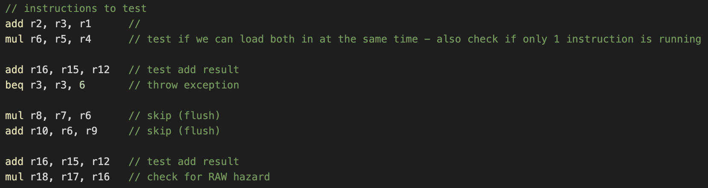

In the above set of 8 test instructions, several aspects of the machine
will be tested. The first two instructions will ensure that the
superscalar dispatch modules work. Next, instructions 3 and 4 will check
for the tag to be loaded from the RAT properly. These two instructions
should not execute until the register R6 is resolved by the multiplier.
The last two instructions will test for the RAW hazard that should be
detected by the dispatch unit.

To allow for these to be read properly, they must be converted into
either binary or hex and stored in the instruction queue. Following the
RISC-V instruction format, the image below shows how the instructions
were created.

Each component of the R-type instruction is split by the bits so it is
easier to visualize. This format can be followed for each instruction as
seen in the following image. For the SB-type instructions, it follows
the same format except funct7 becomes imm1 and the rd field is the imm2.
This is shown below.

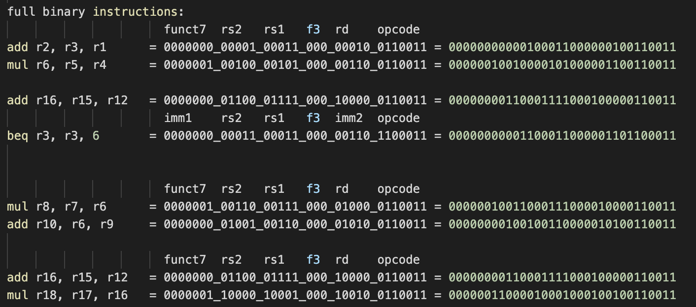

This results in the following set of final instructions that are
directly read into the instruction queue using the \"\$readmemb\"
function.

<!-- ::: cent -->
**Final Instructions**

00000000000100011000000100110011\
00000010010000101000001100110011\
00000000110001111000100000110011\
00000000001100011000001101100011\
00000010011000111000010000110011\
00000000100100110000010100110011\
00000000110001111000100000110011\
00000011000010001000100100110011
<!-- ::: -->

### Expected Results

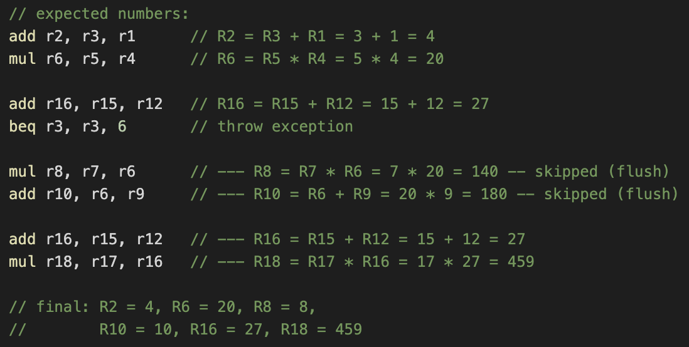

The above figure shows the expected output for each of the registers.
During simulation, the expected output above should be printed out to
the console and shown in the waveforms. These will be used during the
verification process. Instructions 5 and 6 (PC addresses 4 and 5) should
be skipped since the branch instruction will send the PC to instruction
7 (PC address 6).

## Simulation Results

To verify the implementation, the strategy was to print the relevant
outputs each clock cycle and see if they were as expected. This was
aided by analyzing waveforms to determine if signals were initialized
correctly. This strategy ultimately saved time during the debugging
process.

Screenshots of the simulation results can be found in the \"imgs/\"
folder in the Github repository linked in section 5 below.

The image below shows a snippet of the successful output from the clock
cycles 1 and 2 of the program. The first two instructions are starting
to be executed. This is indicated by the \"\[RS ADD\] Received a new
instruction.\" message in clock cycle 1. This is followed by the
reservation station attempting to issue this instruction in clock cycle
2. This is successful and the message \"\[ADD\] Started executing a new
instruction (3+1)\" message appears. The same thing happens for the
multiply instruction. This shows that the first two instructions of the
intended program are issued and running successfully.

The next instructions are the add and branch instructions. In cycle 2
the dispatch unit sends out the branch instruction for it to be checked.
The way the branch checker works, it detects if there is an exception
and tells the ROB. In this case, the test instruction \"beq r3, r3, 6\"
is certainly an exception. This is because r3 has not been modified, so
the branch must be taken. Without branch prediction, we must jump to PC
address 6 now because branches are always predicted as not taken.

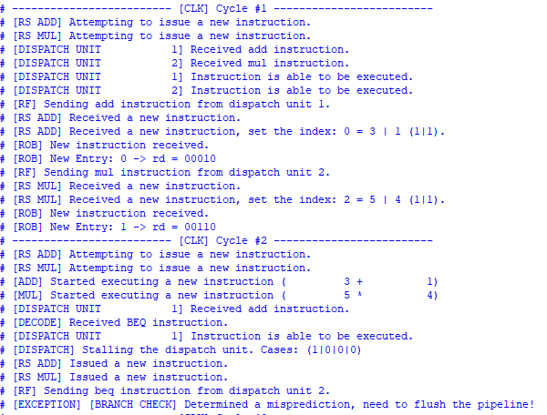

The image below shows the successful write to the register file from the
reorder buffer. This is a crucial step and shows the full completion and
full commit of an instruction. This is just an example of how the
instruction can start and be completed.

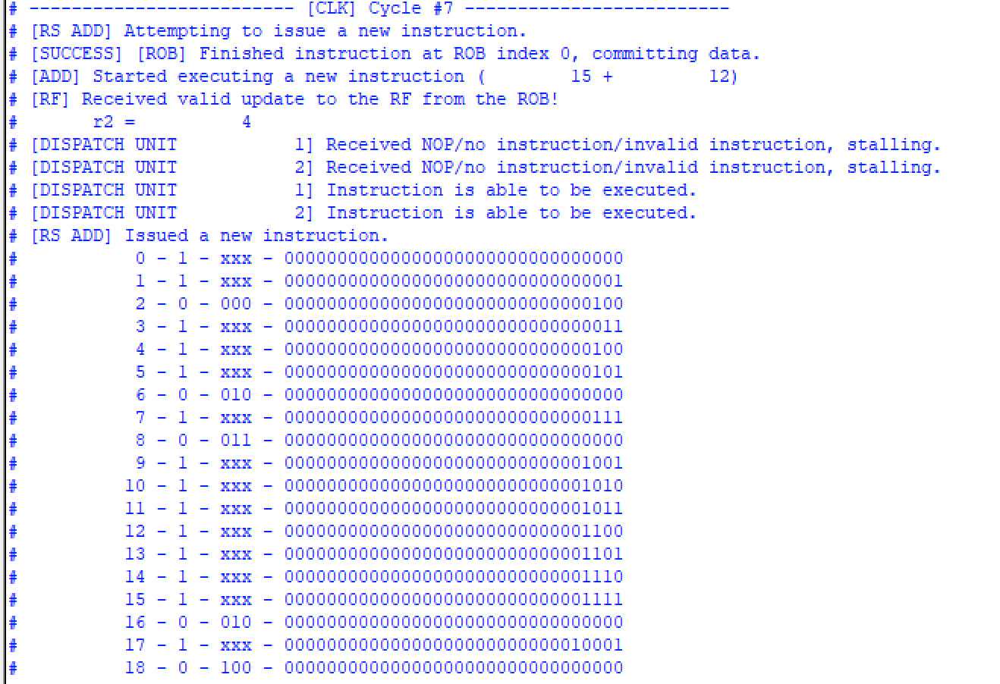

In the above screenshot, the value 4 is written to register two. This is
the output of the instruction \"add r2, r3, r1\". This essentially
means: add 3 + 1 and save it to register 2. The cycles for this
instruction are correct as well. Starting execution in clock cycle 2,
the add instruction takes 4 cycles to complete. In clock cycle 6 this
result is heard. This is shown in the below figure. Every cycle the ROB
will try to commit the tail instruction, which is the \"add r2, r3, r1\"
instruction. It performs the checks which take 1 cycle, thus leaving the
data to return to the RF in cycle $2+4+1=7$.

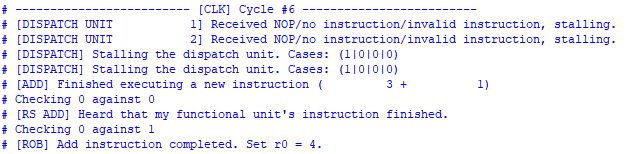

Below is a waveform example output. It shows the correct commit and
execution of the first four instructions. It also shows some of the
signals like the \"current_available_tag\" supplied by the ROB. This
allows instructions to be correctly renamed as necessary.

## Known Bugs

While all of the logic for this project and the project goals have been
implemented, there are a few known bugs that have hindered a perfect
simulation. Some minor bugs have not been ironed out. Completing the
last two instructions does not occur due to dispatch detecting errors
and stalling out. This is a tedious error that would require a lot more
time to debug.

The most important bug is the lack of a flush of the pipeline. Although
it has been implemented in code, it was unable to pass testing.

## Achieved Project Goals

All of the baseline project goals have been implemented and achieved
except for the execution of the pipeline flush. It has been implemented
in code but was unable to reach completion due to time constraints. The
target goal was also implemented but could not be tested due to the
pipeline flush not working correctly.

# Code

The code can be found at the following Github link. It includes images
of the output, as well as any files that were relevant to the completion
of this project. The project was completed in SystemVerilog using Intel
Quartus Prime for synthesis and ModelSim 2020.1 for simulation and
verification.

<!-- ::: center -->
**https://github.com/pjclet/Reorder-Buffer**
<!-- ::: -->

# Conclusion and Summary

Through designing a superscalar out-of-order execution RISC-V processor
with the branch predictor, many challenges have been faced and overcome.
The architecture for a system that completes instructions out-of-order
while maintaining precise exceptions has been designed. With most of the
functionality, a lot of modules had to be designed and tested. Overall
it passed many of the test cases that were designed for it, however, it
is far from perfect.

The greatest challenge for this project was understanding how the
reorder buffer was used and implemented. With limited academic
resources, it was mostly a brainstorm of what the purpose of each field
in the ROB was. Once the purpose of every bit was understood,
implementing the ROB was not too difficult. Also, working with code that
was previously written is difficult, even though I wrote it the first
time. Having to improve performance while simultaneously adding new
modules was a great obstacle. Through this project, I have a clearer
understanding of how precise out-of-order execution machines are
designed and implemented.

# References

        [1] A. Waterman and K. Asanović, “The RISC-V Instruction Set Manual Volume I:
            User-Level ISA Document Version 2.2,” 2017. Available: https://riscv.org/
            wp-content/uploads/2017/05/riscv-spec-v2.2.pdf